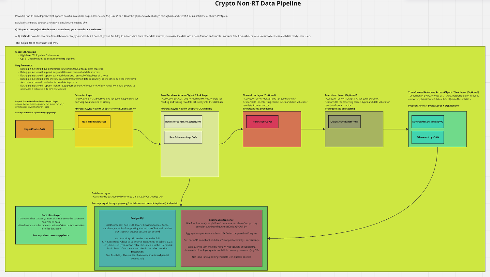

# Crypto Non-RT ETL Pipeline

Powerful Non-RT Data Pipeline that siphons data from multiple crypto data source (e.g QuickNode, Bloomberg) periodically at a high throughput, and ingest it into a database of choice (Postgres).

Databases and Data sources are easily pluggable and change-able

QuickNode provides raw data from Ethereum / Polygon nodes, but it doesn't give us flexibility to extract data from other data sources, normalize the data into a clean format, and transform it with data from other data sources into business-level data ready to be used.

This data pipeline allows us to do that.

## MIRO Architecture 
 


## Project Setup

### Create venv and install dependencies

```commandline
poetry shell
poetry install --no-root
```

### Setup postgresql@14

Project requires postgresql@14.

Spin up a local instance of postgresql@14

```
brew services start postgresql@14
```

Connect to the local instance, and create a new database

```commandline
psql -d postgres
CREATE DATABASE quick_node;
```

Finally, use alembic to create the tables

```
alembic upgrade head
```

## Running the data pipeline to extract and load ethereum block information from quick node, into postgres database

Step 1: Populate .env file with environment variables

Step 2: Run the pipeline

```commandline
export PYTHONPATH=.
python src/quick_node_eth_block_etl_pipeline.py
```
