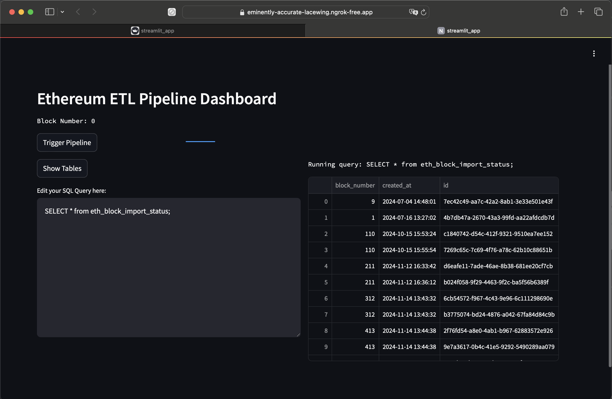
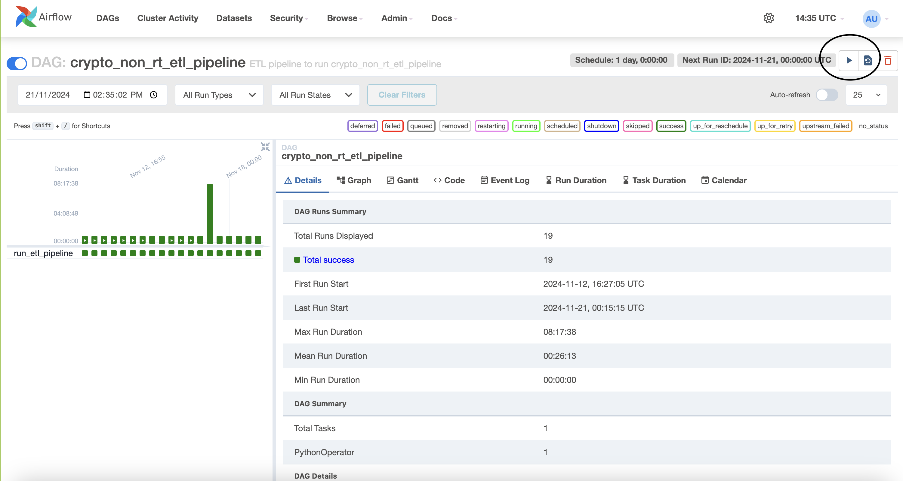
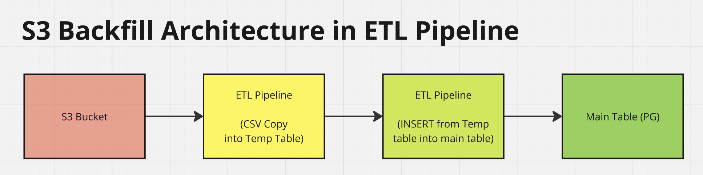
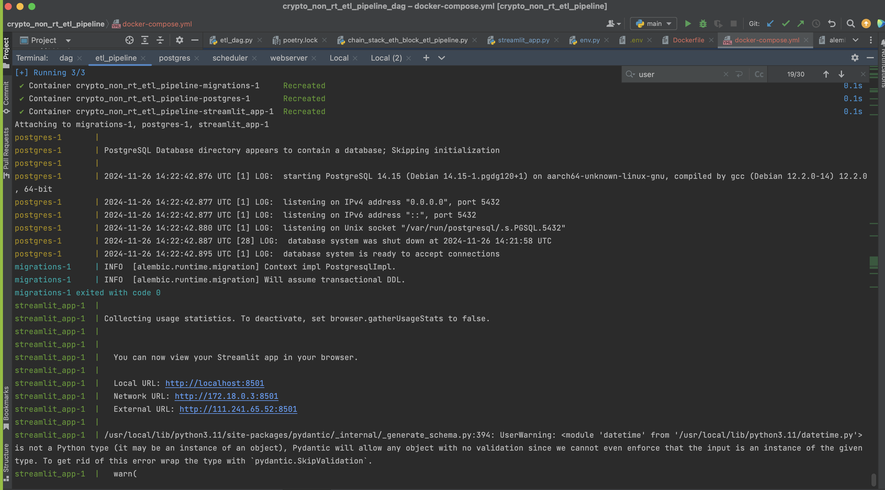

# Crypto Non-RT ETL Pipeline

Powerful Non-RT Data Pipeline that siphons data from multiple crypto data source (e.g QuickNode, Bloomberg) periodically at a high throughput, and ingest it into a database of choice (Postgres).

Databases and Data sources are easily pluggable and change-able

QuickNode provides raw data from Ethereum / Polygon nodes, but it doesn't give us flexibility to extract data from other data sources, normalize the data into a clean format, and transform it with data from other data sources into business-level data ready to be used.

This data pipeline allows us to do that.

REMINDER: to run this on your end, you need a chainstack account, 
or quicknode account (change the environment variables accordingly if this is used)

## MIRO Architecture 
 


## Project Setup

### Create venv and install dependencies

```commandline
poetry shell
poetry install --no-root
```

### Setup postgresql@14

Project requires postgresql@14.

Spin up a local instance of postgresql@14

```
brew services start postgresql@14
```

Connect to the local instance, and create a new database

```commandline
psql -d postgres
CREATE DATABASE quick_node;
```

Finally, use alembic to create the tables

```
alembic upgrade head
```

## Running the data pipeline to extract and load ethereum block information from quick node, into postgres database

Step 1: Populate .env file with environment variables

Step 2: Run the pipeline

```commandline
export PYTHONPATH=.
python src/chain_stack_eth_block_etl_pipeline.py
```

### Streamlit
```commandline
ngrok http --url=eminently-accurate-lacewing.ngrok-free.app 8501
export PYTHONPATH=.
streamlit run client/streamlit_app.py
```
Visit [this link](https://eminently-accurate-lacewing.ngrok-free.app) for a live demo of the streamlit

This streamlit app allows the querying of database and visualizing the data

### Airflow
Refer to [this repository](https://github.com/Eugene2710/crypto_non_rt_etl_pipeline_dag) for ETL pipeline schedule in dag files



### Backfills with CSV files into S3

The data pipeline supports backfill-ing data into the DB

Upload the file under a S3 path, and the ETL pipeline will load it into the DB



### FAQs

#### Q1: What if you don't have this feature:

You will have to manually copy each CSV file into the database / table one by one

But it has drawbacks:
- You have to manually run the command once for every file
- You need the user to have write permissions to the DB

```sql
COPY into my_table(field_1, field_2, field_3) VALUES (:field_1, :field_2, :field_3);
```

#### Q2: Why should we COPY large CSV files (100k rows and above) into a Temporary Table first, before inserting from the temporary table into the DB

Reason 1: Write Optimization. Batch write background operations when inserting into the main table

Inserting a row into a PG main table (with indexes) will trigger background tasks such as rearranging data (according to primary key and foreign key constraints + acquiring table locks), and generating write ahead logs

When data is copied into the temporary table, it doesn't trigger these write background just yet.

Then, when inserting from temporary table into the main table, it will batch these write background operations

### Docker Compose
```commandline
docker login -u "docker_username"
docker-compose up --build --force-recreate --no-deps 
```


## TODOs:
- Integration test the rest of the DAOs
- Unit Test ETLPipeline Service Level class to DTO class
- Explore other types of data to be extracted from Chainstack
- Explore use cases of data