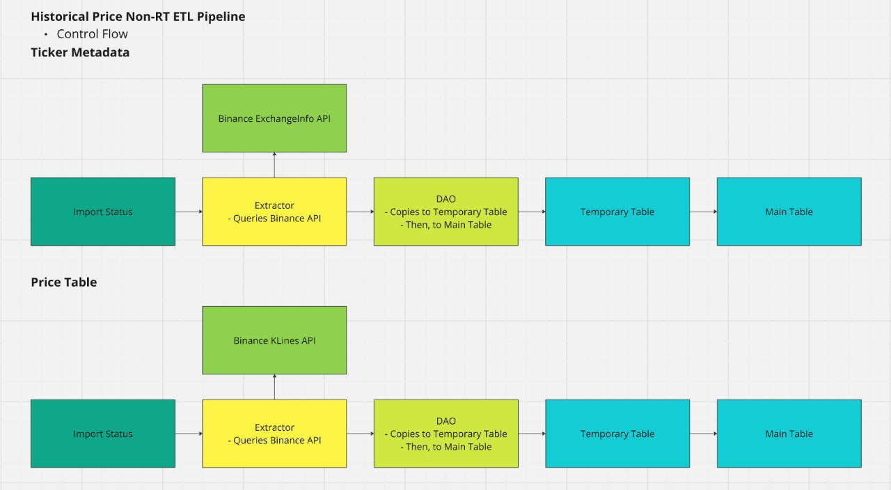

# Binance Price History

## Why Binance API

1. The historical price data has resolution has up to 1 minute for free tier

- [Source](https://developers.binance.com/docs/binance-spot-api-docs/rest-api/market-data-endpoints#klinecandlestick-data)

2. Binance has a generous rate limit

- 1,200/min for free tier

3. Supports JSON-RPC

- JSON-RPC is generally better than HTTP for backend services
  - lower overhead, faster communication, and flexibility with transport layers
  - better suited for high performance, stateful backend-to-backend interactions
- [Source](https://docs.bnbchain.org/bnb-smart-chain/developers/json_rpc/json-rpc-endpoint/)

# System Architecture

### We use a non-rt ETL pipeline architecture to ingest 
(non-rt for now, realtime up next after this is done)

- Ticker Metadata
- Historical Price Metadata

### Key Design Decisions

- Use Postgres as OLTP database - since insertions are more frequent currently
  - ACID compliant - allows for unique constraints with PK, and consistency between tables with transactions and foreign key constrtaints
- Keep track of import status - to avoid ingesting data which already exist in DB
- Abstract querying Binance into Extractor class
- Abstract saving data in bulk to DB, into DAO class
  - Optimization: COPY to TEMP table -> MAIN table



## Data Modelling

Key Design Decisions

- ETL Design
- Save the raw data as it is, in their own separate raw tables
- Then, transform the raw data into a normalized format in a separate table

1. `ticker_metadata`

- Raw Table, same format as Exchange Info API
- Append only table (Point in Time)
- Storing the list of tickers from Binance
- Tickers are used to query historical price data from the KLines API

For simplicity, we will store only the tickers for now

```sql
CREATE TABLE IF NOT EXITS binance_ticker_metadata (
  symbol VARCHAR(20) NOT NULL, -- e.g. ETHBTC
  server_time TIMESTAMP NOT NULL, -- e.g time of data, returned by binance
  status VARCHAR(20) NOT NULL, -- e.g. TRADING
  base_asset VARCHAR(20) NOT NULL, -- e.g. ETH
  quote_asset VARCHAR(20) NOT NULL, -- e.g BTC
  created_at TIMESTAMP DEFAULT CURRENT_TIMESTAMP
  PRIMARY_KEY (symbol, server_time)
);
```

To use the table, query for the latest server time

```sql
SELECT
  symbol,
  server_time,
  status,
  base_asset,
  quote_asset
FROM binance_ticker_metadata
ORDER BY server_time DESC 
LIMIT 1
```

2. `klines_metadata`

- Raw Table - same format as Kline/Candlestick data
- stores the candlestick price data
- standardize to 1 minute currently

```sql
CREATE TABLE IF NOT EXISTS binance_klines_prices(
  symbol VARCHAR(20) NOT NULL,
  kline_open_time TIMESTAMP NOT NULL,
  kline_close_time TIMESTAMP NOT NULL,
  open_price DOUBLE NOT NULL,
  high_price DOUBLE NOT NULL,
  low_price DOUBLE NOT NULL
  close_price DOUBLE NOT NULL,
  volume DOUBLE NOT NULL,
  quote_asset_vol DOUBLE NOT NULL,
  number_of_trades INTEGER NOT NULL,
  taker_buy_base_asset_vol DOUBLE NOT NULL,
  taker_buy_quote_asset_vol DOUBLE NOT NULL,
  created_at TIMESTAMP DEFAULT CURRENT_TIMESTAMP
  PRIMARY_KEY (symbol, kline_open_time)
)
```

To query the price at a given timestamp (kline_open_time), query by symbol and kline open time

```sql
SELECT
  symbol,
  kline_open_time,
  open_price
FROM binance_klines_prices
```

## APIs used

### 1. Exchange Info

Gets the list of tickers

<details>

<summary>Format</summary>

```json
{
  "timezone": "UTC",
  "serverTime": 1565246363776,
  "rateLimits": [
    {
      // These are defined in the `ENUM definitions` section under `Rate Limiters (rateLimitType)`.
      // All limits are optional
    }
  ],
  "exchangeFilters": [
    // These are the defined filters in the `Filters` section.
    // All filters are optional.
  ],
  "symbols": [
    {
      "symbol": "ETHBTC",
      "status": "TRADING",
      "baseAsset": "ETH",
      "baseAssetPrecision": 8,
      "quoteAsset": "BTC",
      "quotePrecision": 8, // will be removed in future api versions (v4+)
      "quoteAssetPrecision": 8,
      "baseCommissionPrecision": 8,
      "quoteCommissionPrecision": 8,
      "orderTypes": [
        "LIMIT",
        "LIMIT_MAKER",
        "MARKET",
        "STOP_LOSS",
        "STOP_LOSS_LIMIT",
        "TAKE_PROFIT",
        "TAKE_PROFIT_LIMIT"
      ],
      "icebergAllowed": true,
      "ocoAllowed": true,
      "otoAllowed": true,
      "quoteOrderQtyMarketAllowed": true,
      "allowTrailingStop": false,
      "cancelReplaceAllowed":false,
      "isSpotTradingAllowed": true,
      "isMarginTradingAllowed": true,
      "filters": [
        // These are defined in the Filters section.
        // All filters are optional
      ],
      "permissions": [],
      "permissionSets": [
        [
          "SPOT",
          "MARGIN"
        ]
      ],
      "defaultSelfTradePreventionMode": "NONE",
      "allowedSelfTradePreventionModes": [
        "NONE"
      ]
    }
  ],
  // Optional field. Present only when SOR is available.
  // https://github.com/binance/binance-spot-api-docs/blob/master/faqs/sor_faq.md
  "sors": [
    {
      "baseAsset": "BTC",
      "symbols": [
        "BTCUSDT",
        "BTCUSDC"
      ]
    }
  ]
}
```

</details>

[Source - Exchange Info](https://developers.binance.com/docs/binance-spot-api-docs/rest-api/general-endpoints)

### 2. Kline / Candlestick

Obtains the following info for a given Candlestick. The candlestick has a resolution of 1 minute
-- 1 second resolution works, whereas ticker price(to get latest price for a symbol) has 1 minute resolution
- Kline open time
- Open Price
- High Price
- Low Price
- Close Price
- Volume
- Kline Close Time
- Quote Asset Volume
- Number of Trades
- Taker buy base asset volume
- Taker buy quote asset volume
- Unused field, ignore

<details>

<summary>Format</summary>

```json
[
  [
    1499040000000, // Kline open time
    "0.01634790", // Open price
    "0.80000000", // High price
    "0.01575800", // Low price
    "0.01577100", // Close price
    "148976.11427815", // Volume
    1499644799999, // Kline Close time
    "2434.19055334", // Quote asset volume
    308, // Number of trades
    "1756.87402397", // Taker buy base asset volume
    "28.46694368", // Taker buy quote asset volume
    "0" // Unused field, ignore.
  ]
]
```

</details>

[Source - Kline/Candlestick data](https://developers.binance.com/docs/binance-spot-api-docs/rest-api/market-data-endpoints#klinecandlestick-data)
